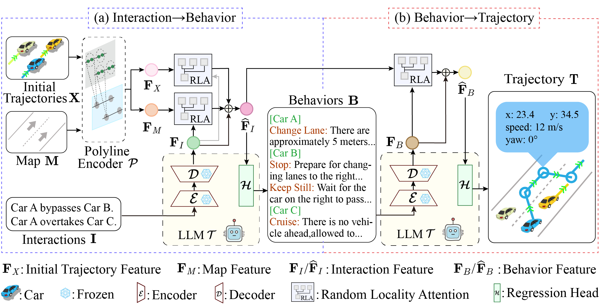
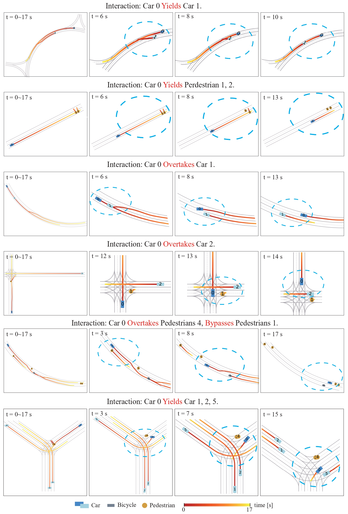
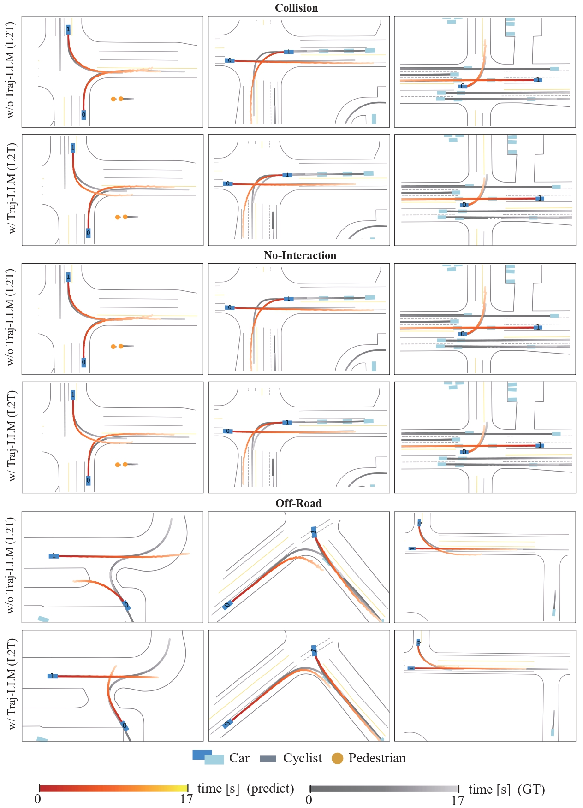
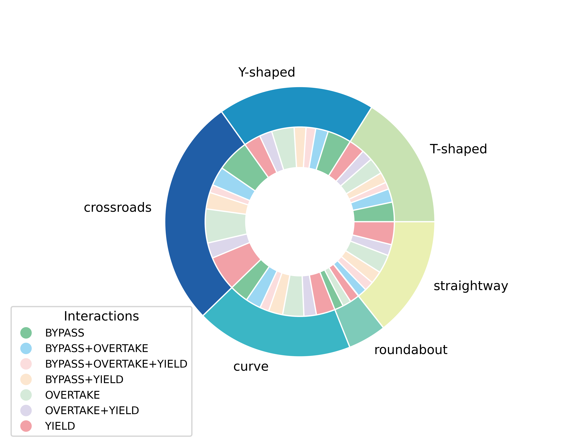
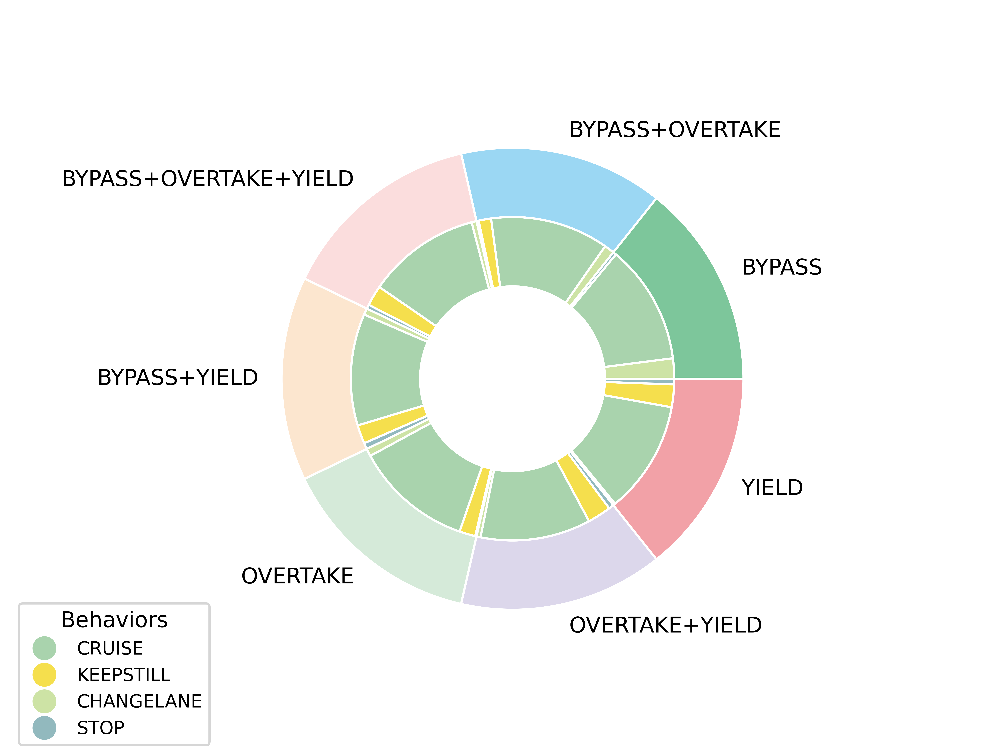
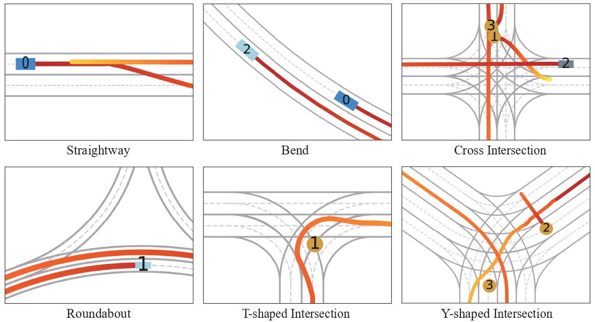

# Trajectory-LLM

**Trajectory-LLM: A Language-based Data Generator for Trajectory Prediction in Autonomous Driving**

<p align="center">
     
     <br/> Traj-LLM proposes a two-stage "interaction-behavior-trajectory" translation. (a) We employ LLM with the random locality attention to translate the textual description of vehicle interactions into the behavior of each vehicle. Each behavior is associated with the underlying logic. (b) Given the vehicle interactions and behaviors, LLM translates them to the sequential motion parameters that represent the trajectory of each vehicle.
</p>

## Visualization Results

In this section, we  provide some visualization results of trajectories generated byTraj-LLM.

### Generated Trajectories

<p align="center">
     
     <br/> Traj-LLM has the ability to generalize well to scenarios involving traffic cones, bicycles, and pedestrians.
</p>

### Positive Influence for Trajectory Prediction

<p align="center">
     
     <br/> The positive influence of adding the trajectories generated by Traj-LLM for training the trajectory prediction model, MTR, it reduces Collision, No-Interaction, and Off-Road in the trajectory prediction task.
</p>

## Getting Started

### L2T Dataset

We create a brand-new **Language-to-Trajectory (L2T)** dataset, including **240K** textual descriptions of vehicle interactions and behaviors, each paired with corresponding map topologies and vehicle trajectory segments.

Considering the limitations of the GitHub, we provide a **mini-version** of the dataset here. We will provide the full dataset upon the paper acceptance.

<br>

<p align="center">
  
  
  <br/> The proportion of each type of map (left) and the proportion of different types of behaviors that occur along with
each type of interactions and combinations (right).
</p>

<br>

<p align="center">
     
     <br/> The L2T dataset contains six kinds of road topologies, including straightway, bend, roundabout, cross/T-shaped/Y-shaped intersection.
</p>

- **dataset/L2T_train_mini_400.json**
  The mini-version L2T dataset stored in original format.

### Training/Testing Dataset

- **dataset/trajllm_train_mini_10k.pkl**
  This training dataset was created by processing the L2T dataset and is intended for training Traj-LLM.
- **dataset/trajllm_test_mini_1k.pkl**
  This testing dataset was created by processing the L2T dataset and is intended for testing Traj-LLM.

### Startup

- **Install dependencies**

```sh
pip install -r requirements.txt
```

### Training

Edit **llama_model_path** in scripts/train.sh

```sh
--base_model llama_model_path
```

then execute the train bash script

```sh
bash scripts/train.sh
```

### Testing

Edit **llama_model_path** and **weight_dir** in scripts/test.sh

```sh
--base_model llama_model_path \
--weight_dir weight_dir \
```

then execute the test bash script

```sh
bash scripts/test.sh
```
